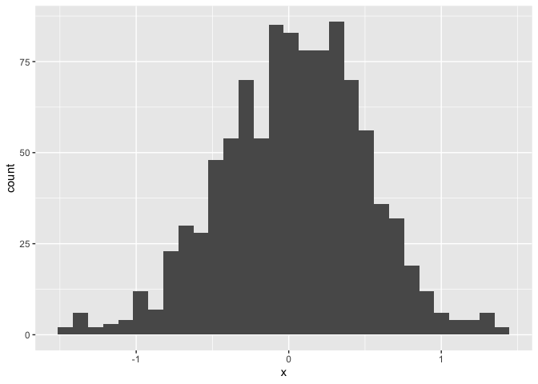
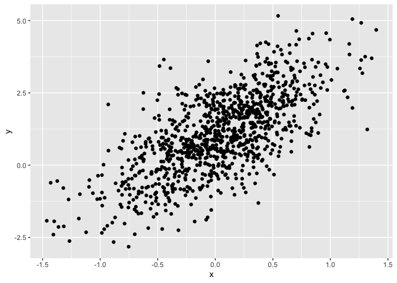
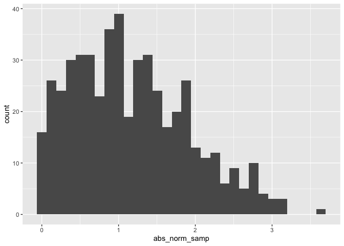

Lecture 3
================
Tiffany
2026-09-15

I’m an R Markdown document!

# Section 0: Library

``` r
library(tidyverse)
```

# Section 1

Here’s a **code chunk** that samples from a *normal distribution*:

``` r
samp = rnorm(100)
length(samp)
```

    ## [1] 100

# Section 2

I can take the mean of the sample, too! The mean is 0.0048818.

# Section 3: Tibble

I can create a new data frame.

``` r
plot_df = 
  tibble(
    x = rnorm(1000, sd = 0.5),
    y = 1 + 2 * x + rnorm(1000),
  )
head(plot_df)
```

    ## # A tibble: 6 × 2
    ##         x      y
    ##     <dbl>  <dbl>
    ## 1  0.973   2.60 
    ## 2 -0.753  -2.82 
    ## 3  0.203   0.647
    ## 4  0.291   2.01 
    ## 5  0.0184  2.18 
    ## 6 -0.825  -1.36

# Section 4: Plots

These are plots from our random sample.

<!-- --><!-- -->

# Section 5: Learning Assessment 2

Write a named code chunk that creates a dataframe comprised of: a
numeric variable containing a random sample of size 500 from a normal
variable with mean 1; a logical vector indicating whether each sampled
value is greater than zero; and a numeric vector containing the absolute
value of each element. Then, produce a histogram of the absolute value
variable just created. Add an inline summary giving the median value
rounded to two decimal places. What happens if you set eval = FALSE to
the code chunk? What about echo = FALSE?

``` r
la2_df = 
  tibble(
    norm_samp = rnorm(500, mean = 1),
    log_norm_samp = norm_samp > 0,
    abs_norm_samp = abs(norm_samp)
  )
```

``` r
ggplot(la2_df, aes(x = abs_norm_samp)) + geom_histogram()
```

    ## `stat_bin()` using `bins = 30`. Pick better value `binwidth`.

<!-- -->

The median is 1.02.

# Section 6: Formatting

## Text formatting

*italic* or *italic* **bold** or **bold** `code` superscript<sup>2</sup>
and subscript<sub>2</sub>

## Headings

# 1st Level Header

## 2nd Level Header

### 3rd Level Header

## Lists

- Bulleted list item 1

- Item 2

  - Item 2a

  - Item 2b

1.  Numbered list item 1

2.  Item 2. The numbers are incremented automatically in the output.

## Tables

| First Header | Second Header |
|--------------|---------------|
| Content Cell | Content Cell  |
| Content Cell | Content Cell  |

# Section 7: Learning Assessment 3

After the previous code chunk, write a bullet list given the mean,
median, and standard deviation of the original random sample.

- The mean is 1.02.

- The median is 1.02.

- The standard deviation is 0.94.
